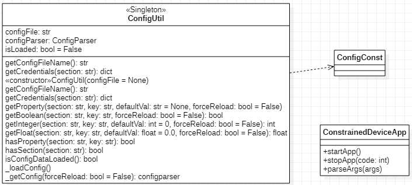

# Constrained Device Application (Connected Devices)

## Lab Module 01

### Description

What does your implementation do? 

1. Development environment configuration

    For python CDA, I already have Anaconda with python 3.7 installed. So I just created a virtual environment by using `virtualenv` in project directory and set related configuration on Eclipse with PyDev. TODO

2. Set CI/CD for auto testing

    For CDA, I just setup a script to run lint with flake8 and run tests (those related to Lab 01) with `unittest` : [unittest workflow file](../../.github/workflows/python-app.yml)

3. Workflow(kanban board) for myself
   
    Like my GDA, I also setup a kanban board on Github Project which is similar to kanban board of our course. I named it: [Course Project - GDA](https://github.com/NU-CSYE6530-Fall2020/constrained-device-app-Taowyoo/projects/1)

How does your implementation work?

1. CI/CD with GitHub Action

    As mentioned above. The .yml files under .github/workflows/ will be read by Github and been run as task automatically when I push or pull request to specific branch. At current, I set it will be triggered when there is new push or pull request on `chapter01` and `alpha001`.

    Slightly different to our java GDA, for my python CDA, `unittest` will be used as my main test framework. 
    
    To setup it to be run in a container, the PYTHONPATH should be set:
    
    `export PYTHONPATH=${PYTHONPATH}:./src/main/python:./src/test/python`

    Then I use cmd to run unittest that related to lab 01, so there are two tests:
    1. `./src/test/python/programmingtheiot/part01/unit/common/ConfigUtilTest`
    2. `./src/test/python/programmingtheiot/part01/integration/app/ConstrainedDeviceAppTest`

    Here is how it looks like after several my push's:
    

### Code Repository and Branch

URL: https://github.com/NU-CSYE6530-Fall2020/constrained-device-app-Taowyoo/tree/chapter01

### UML Design Diagram(s)

diagram you provide will look similar to, but not the same as, its counterpart in the
book [Programming the IoT](https://learning.oreilly.com/library/view/programming-the-internet/9781492081401/). -->

Here is the class diagram for ConstrainedDeviceApp, ConfigUtil, ConfigConst:

### Unit Tests Executed

- programmingtheiot.part01.unit.common.ConfigUtilTest

### Integration Tests Executed

- programmingtheiot.part01.integration.app.ConstrainedDeviceAppTest

