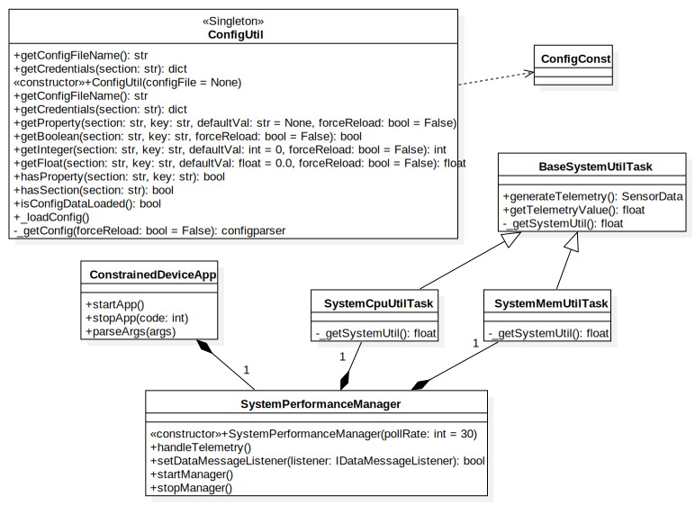

# Constrained Device Application (Connected Devices)

## Lab Module 02

<!-- Be sure to implement all the PIOT-CDA-* issues (requirements) listed at [PIOT-INF-02-001 - Chapter 02](https://github.com/orgs/programming-the-iot/projects/1#column-9974938). -->

### Description

<!-- NOTE: Include two full paragraphs describing your implementation approach by answering the questions listed below. -->

What does your implementation do? 

1. Implement the logic of getting system util data:
   1. Implement Classes: `BaseSystemUtilTask`, `SystemCpuUtilTask`, `SystemMemUtilTask`.
   2. Implement Class: `SystemPerformanceManager`.
   3. Integrate `SystemPerformanceManager` with `SystemCpuUtilTask` and `SystemMemUtilTask`.
   4. Integrate `ConstrainedDeviceApp` with `SystemPerformanceManager`

How does your implementation work?

1. `SystemCpuUtilTask` and `SystemMemUtilTask` is subclass of `BaseSystemUtilTask`, implement the template method to retrieve System Util Info: CPU occupied percentage and Memory occupied percentage.
2. `SystemPerformanceManager` call `SystemCpuUtilTask` and `SystemMemUtilTask` to retrieve Telemetry value and generate Telemetry `SensorData`.
3. `SystemPerformanceManager` use `BackgroundScheduler` to periodically call `SystemCpuUtilTask` and `SystemMemUtilTask` to get Telemetry value according to given `pollRate` which default value is 30 seconds.
4. `ConstrainedDeviceApp`  creates an instance of `SystemPerformanceManager` and start it.

### Code Repository and Branch

<!-- NOTE: Be sure to include the branch (e.g. https://github.com/programming-the-iot/python-components/tree/alpha001). -->

URL: https://github.com/NU-CSYE6530-Fall2020/constrained-device-app-Taowyoo

### UML Design Diagram(s)

<!-- NOTE: Include one or more UML designs representing your solution. It's expected each
diagram you provide will look similar to, but not the same as, its counterpart in the
book [Programming the IoT](https://learning.oreilly.com/library/view/programming-the-internet/9781492081401/). -->
Here is the UML class diagram of classes we edited so far:

### Unit Tests Executed

<!-- NOTE: TA's will execute your unit tests. You only need to list each test case below
(e.g. ConfigUtilTest, DataUtilTest, etc). Be sure to include all previous tests, too,
since you need to ensure you haven't introduced regressions. -->

- ConfigUtilTest
- SystemCpuUtilTaskTest
- SystemMemUtilTaskTest

### Integration Tests Executed

NOTE: TA's will execute most of your integration tests using their own environment, with
some exceptions (such as your cloud connectivity tests). In such cases, they'll review
your code to ensure it's correct. As for the tests you execute, you only need to list each
test case below (e.g. SensorSimAdapterManagerTest, DeviceDataManagerTest, etc.)

- ConstrainedDeviceAppTest
- SystemPerformanceManagerTest
