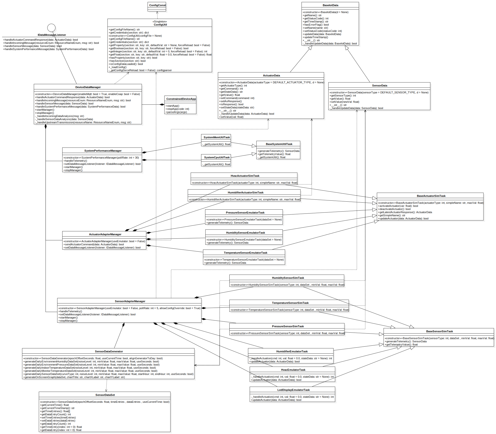

# Constrained Device Application (Connected Devices)

## Lab Module 04

### Description

<!-- NOTE: Include two full paragraphs describing your implementation approach by answering the questions listed below. -->

What does your implementation do? 

1. Install the SenseHAT emulator on my Win10 and ubuntu20.04 OS.
2. Finish the implementation of Sensor and Actuator Emulator Classes: `HumidifierEmulatorTask`, `HumiditySensorEmulatorTask`, `HvacEmulatorTask`, `LedDisplayEmulatorTask`, `PressureSensorEmulatorTask`, `TemperatureSensorEmulatorTask`.
    
    All these classes are derived from `BaseSensorSimTask` and `BaseActuatorSimTask`.
    
    I simply add the specific implementation for them: `generateTelemetry` and `_handleActuation`, `updateActuator`.

3. Integrate these emulator tasks with `SensorAdapterManager` or `ActuatorAdapterManager`.

How does your implementation work?

1. For preparation for SenseHAT emulator:
   1. In win10: I use WSL with ubuntu18.04 to install it:
      1. Install and configure GTK and PyGObject according to [pygobject docs](https://pygobject.readthedocs.io/en/latest/getting_started.html)
      2. Install and configure the SenseHAT emulator according to [sense-emu docs](https://sense-emu.readthedocs.io/en/v1.1/index.html)
      3. To show the GUI in the Win10, I installed the [Xming](http://www.straightrunning.com/XmingNotes/), there is something to specific that:
         1. To make Xming run correctly, because WSL is running with a IP which is defined as external ip by win10, an extra argument should be add to the Xming:
            Add `-ac` to the target entry at Xming Shortcut, it will be like this: `"C:\Program Files (x86)\Xming\Xming.exe" :0 -ac -clipboard -multiwindow`
2. For these EmulatorTask's:
   1. Add implementation of `generateTelemetry` to generate `SensorData` by using pisense Environment Sensors API.
   2. Add implementation of `_handleActuation` to execute command by using pisense LED screen API to scroll text on SenseHAT screen.
3. For `SensorAdapterManager` and `ActuatorAdapterManager`: Add related codes for the case when `useEmulator` is True:
      1. Create instances in constructor.
      2. Add code to handle `SensorData` or `ActuatorData` in method: `handleTelemetry` or `sendActuatorCommand`.

### Code Repository and Branch

<!-- NOTE: Be sure to include the branch (e.g. https://github.com/programming-the-iot/python-components/tree/alpha001). -->

URL: https://github.com/NU-CSYE6530-Fall2020/constrained-device-app-Taowyoo/tree/chapter04

### UML Design Diagram(s)

Here is the [class diagram](../../doc/UML/Lab04.svg) of latest code:

<!-- NOTE: Include one or more UML designs representing your solution. It's expected each
diagram you provide will look similar to, but not the same as, its counterpart in the
book [Programming the IoT](https://learning.oreilly.com/library/view/programming-the-internet/9781492081401/). -->

### Unit Tests Executed

All Unit Tests in part02:

- src/test/python/programmingtheiot/part02/unit/data/ActuatorDataTest.py
- src/test/python/programmingtheiot/part02/unit/data/DataUtilTest.py
- src/test/python/programmingtheiot/part02/unit/data/SensorDataTest.py
- src/test/python/programmingtheiot/part02/unit/data/SystemPerformanceDataTest.py
- src/test/python/programmingtheiot/part02/unit/sim/HumidifierActuatorSimTaskTest.py
- src/test/python/programmingtheiot/part02/unit/sim/HumiditySensorSimTaskTest.py
- src/test/python/programmingtheiot/part02/unit/sim/HvacActuatorSimTaskTest.py
- src/test/python/programmingtheiot/part02/unit/sim/PressureSensorSimTaskTest.py
- src/test/python/programmingtheiot/part02/unit/sim/TemperatureSensorSimTaskTest.py

### Integration Tests Executed

- src/test/python/programmingtheiot/part02/integration/emulated/HumidifierEmulatorTaskTest.py
- src/test/python/programmingtheiot/part02/integration/emulated/HvacEmulatorTaskTest.py
- src/test/python/programmingtheiot/part02/integration/emulated/LedDisplayEmulatorTaskTest.py
- src/test/python/programmingtheiot/part02/integration/emulated/SenseHatEmulatorQuickTest.py
- src/test/python/programmingtheiot/part02/integration/emulated/SensorEmulatorManagerTest.py
- src/test/python/programmingtheiot/part02/integration/emulated/ActuatorEmulatorManagerTest.py
- src/test/python/programmingtheiot/part02/integration/system/ActuatorAdapterManagerTest.py
- src/test/python/programmingtheiot/part02/integration/system/SensorAdapterManagerTest.py
