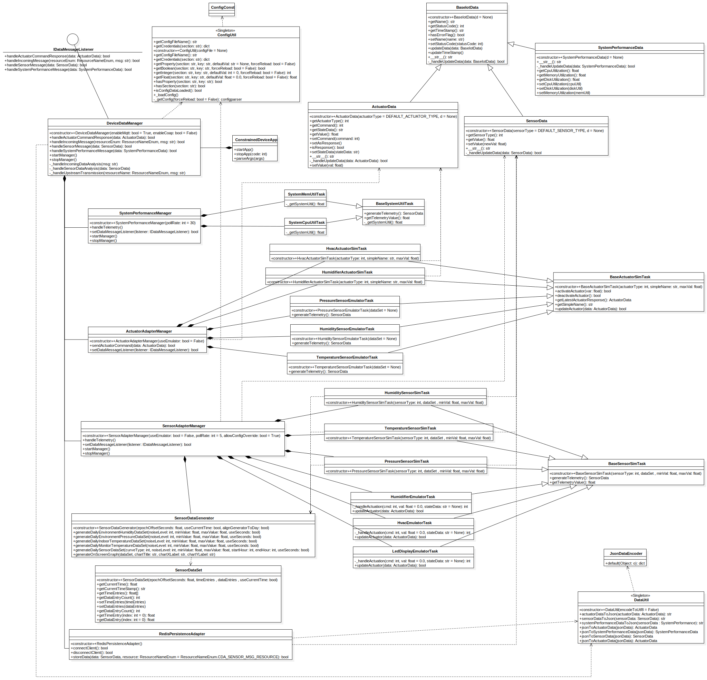

# Constrained Device Application (Connected Devices)

## Lab Module 05

### Description

#### What does your implementation do? 

- Install Redis in Ubuntu 18.04 in WSL.
- Implement **Json to Class** and **Class to Json** functions in `DataUtil` class.
- Add a function that enable Data containers to initialize and construct instance from a `dict` object.
- Implement `RedisPersistenceAdapter` class.
- Integrate `RedisPersistenceAdapter` into `DeviceDataManager `
- Implement test for `RedisPersistenceAdapter` class

#### How does your implementation work?

- Use following lines to install Redis:

  ```shell
  sudo apt-get install redis-server hugepages
  ```

- Use python `json` module to implement Json Conversion:

  - Use `json.dumps()` to convert object to Json string, and use a custom `JsonDataEncoder` to just convert object by its  `dict` form:

    ```python
    class JsonDataEncoder(JSONEncoder):
    	"""
    	Convenience class to facilitate JSON encoding of an object that
    	can be converted to a dict.
    	"""
    	def default(self, o):
    		"""
    		Override default JSONEncoder method
    		:param o: Given object
    		:return: Use dict format of object as the way to encode object
    		"""
    		return o.__dict__
    ```

  - Use `json.loads` to convert Json string to object.

  - By changing Boolean parameter `ensure_ascii` in `json.dumps()` to implement the feature of whether encode object to Json string using UTF8.
    
  - Note: after python3, when `ensure_ascii` is `False`, the Json module will automatically convert Object to string by using UTF8.
    
  
- Use `redis` module to implement `RedisPersistenceAdapter` class:

  - Use `pip install redis`to install `reids` module.
  - Use `ConfigUtil` to get configuration of Redis Server.
  - Create `redis.client.Redis` with configuration to connect to Redis Server.
  - Use `redis.client.Redis.publish()` to publish newly generated `SensorData`.

- Add `RedisPersistenceAdapter` instance and related code in `DeviceDataManager`.

### Code Repository and Branch

URL: https://github.com/NU-CSYE6530-Fall2020/constrained-device-app-Taowyoo/tree/alpha001

### UML Design Diagram(s)

Here is the [class diagram](../../doc/UML/Lab05.svg) of latest code:


### Unit Tests Executed

- src/test/python/programmingtheiot/part02/unit/data/DataUtilTest
- src/test/python/programmingtheiot/part01/unit/system/SystemCpuUtilTaskTest
- src/test/python/programmingtheiot/part01/unit/system/SystemMemUtilTaskTest

### Integration Tests Executed

- src/test/python/programmingtheiot/part02/integration/data/DataIntegrationTest
- src/test/python/programmingtheiot/part02/integration/connection/RedisClientAdapterTest
- src/test/python/programmingtheiot/part01/integration/app/ConstrainedDeviceAppTest
