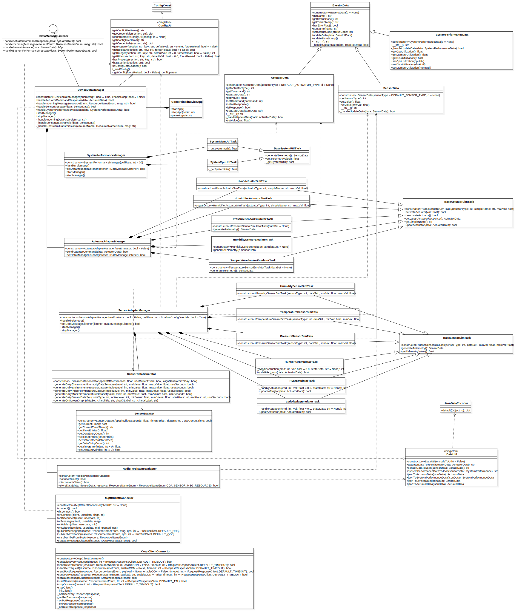

# Constrained Device Application (Connected Devices)

## Lab Module 09

### Description

#### What does your implementation do? 

1. Update [`CoapClientConnecter`](../../src/main/python/programmingtheiot/cda/connection/CoapClientConnector.py) class.
2. Update unittest for [`CoapClientConnecter`](../../src/main/python/programmingtheiot/cda/connection/CoapClientConnector.py): [`CoapClientConnectorTest`](../../src/test/python/programmingtheiot/part03/integration/connection/CoapClientConnectorTest.py).
3. Use Wireshark to capture packets transmitted during tests.

#### How does your implementation work?

1. Add DISCOVER,GET,POST,DELETE,PUT functionalities into [`CoapClientConnecter`](../../src/main/python/programmingtheiot/cda/connection/CoapClientConnector.py) class. Also, add callbacks for these CoAP request functions.
2. Add 2 functions which are going to test CoAP request with CON or NON flag for all GET,POST,DELETE,PUT functions.
   Add test for test DISCOVER request function.
3. While testing, open wireshark to capture network packets on loopback interface because I started my GDA app on `localhost`.

### Code Repository and Branch

URL: https://github.com/NU-CSYE6530-Fall2020/constrained-device-app-Taowyoo/tree/alpha001

### UML Design Diagram(s)

Here is latest class diagram of current code:


### Unit Tests Executed

- All unit tests in part01
- All unit tests in part02

### Integration Tests Executed

- All integrations tests in part02/system
- src/test/python/programmingtheiot/part03/integration/connection/MqttClientConnectorTest
- src/test/python/programmingtheiot/part03/integration/connection/CoapClientConnectorTest

### Captured CoAP Packets

#### DISCOVER

```
Constrained Application Protocol, Confirmable, GET, MID:37466
    01.. .... = Version: 1
    ..00 .... = Type: Confirmable (0)
    .... 0000 = Token Length: 0
    Code: GET (1)
    Message ID: 37466
    Opt Name: #1: Uri-Path: .well-known
    Opt Name: #2: Uri-Path: core
    [Uri-Path: /.well-known/core]
```
```
Constrained Application Protocol, Acknowledgement, 2.05 Content, MID:37466
    01.. .... = Version: 1
    ..10 .... = Type: Acknowledgement (2)
    .... 0000 = Token Length: 0
    Code: 2.05 Content (69)
    Message ID: 37466
    Opt Name: #1: Content-Format: application/link-format
    End of options marker: 255
    Payload: Payload Content-Format: application/link-format, Length: 420

```

#### GET

1. With CON

```
Constrained Application Protocol, Confirmable, GET, MID:37467
    01.. .... = Version: 1
    ..00 .... = Type: Confirmable (0)
    .... 0010 = Token Length: 2
    Code: GET (1)
    Message ID: 37467
    Token: 6269
    Opt Name: #1: Uri-Path: ProgrammingIoT
    Opt Name: #2: Uri-Path: ConstrainedDevice
    Opt Name: #3: Uri-Path: MgmtStatusMsg
    [Uri-Path: /ProgrammingIoT/ConstrainedDevice/MgmtStatusMsg]
    [Response In: 37]
```
```
Constrained Application Protocol, Acknowledgement, 4.04 Not Found, MID:37467
    01.. .... = Version: 1
    ..10 .... = Type: Acknowledgement (2)
    .... 0010 = Token Length: 2
    Code: 4.04 Not Found (132)
    Message ID: 37467
    Token: 6269
    [Uri-Path: /ProgrammingIoT/ConstrainedDevice/MgmtStatusMsg]
    [Request In: 36]
    [Response Time: 0.004756066 seconds]

```

2. With NON

```
Constrained Application Protocol, Non-Confirmable, GET, MID:37468
    01.. .... = Version: 1
    ..01 .... = Type: Non-Confirmable (1)
    .... 0010 = Token Length: 2
    Code: GET (1)
    Message ID: 37468
    Token: 7468
    Opt Name: #1: Uri-Path: ProgrammingIoT
    Opt Name: #2: Uri-Path: ConstrainedDevice
    Opt Name: #3: Uri-Path: MgmtStatusMsg
    [Uri-Path: /ProgrammingIoT/ConstrainedDevice/MgmtStatusMsg]
```
```
Constrained Application Protocol, Non-Confirmable, 4.04 Not Found, MID:2499
    01.. .... = Version: 1
    ..01 .... = Type: Non-Confirmable (1)
    .... 0010 = Token Length: 2
    Code: 4.04 Not Found (132)
    Message ID: 2499
    Token: 7468
    [Uri-Path: /ProgrammingIoT/ConstrainedDevice/MgmtStatusMsg]
```

#### DELETE

1. With CON

```
Constrained Application Protocol, Confirmable, DELETE, MID:19350
    01.. .... = Version: 1
    ..00 .... = Type: Confirmable (0)
    .... 0010 = Token Length: 2
    Code: DELETE (4)
    Message ID: 19350
    Token: 4d4f
    Opt Name: #1: Uri-Path: ProgrammingIoT
    Opt Name: #2: Uri-Path: ConstrainedDevice
    Opt Name: #3: Uri-Path: MgmtStatusMsg
    [Uri-Path: /ProgrammingIoT/ConstrainedDevice/MgmtStatusMsg]
    [Response In: 136]
```
```
Constrained Application Protocol, Acknowledgement, 4.04 Not Found, MID:19350
    01.. .... = Version: 1
    ..10 .... = Type: Acknowledgement (2)
    .... 0010 = Token Length: 2
    Code: 4.04 Not Found (132)
    Message ID: 19350
    Token: 4d4f
    [Uri-Path: /ProgrammingIoT/ConstrainedDevice/MgmtStatusMsg]
    [Request In: 134]
    [Response Time: 0.000864337 seconds]
```

2. With NON

```
Constrained Application Protocol, Non-Confirmable, DELETE, MID:19351
    01.. .... = Version: 1
    ..01 .... = Type: Non-Confirmable (1)
    .... 0010 = Token Length: 2
    Code: DELETE (4)
    Message ID: 19351
    Token: 7377
    Opt Name: #1: Uri-Path: ProgrammingIoT
    Opt Name: #2: Uri-Path: ConstrainedDevice
    Opt Name: #3: Uri-Path: MgmtStatusMsg
    [Uri-Path: /ProgrammingIoT/ConstrainedDevice/MgmtStatusMsg]
```
```
Constrained Application Protocol, Non-Confirmable, 4.04 Not Found, MID:2500
    01.. .... = Version: 1
    ..01 .... = Type: Non-Confirmable (1)
    .... 0010 = Token Length: 2
    Code: 4.04 Not Found (132)
    Message ID: 2500
    Token: 7377
    [Uri-Path: /ProgrammingIoT/ConstrainedDevice/MgmtStatusMsg]
```

#### POST

1. With CON

```
Constrained Application Protocol, Confirmable, POST, MID:19355
    01.. .... = Version: 1
    ..00 .... = Type: Confirmable (0)
    .... 0010 = Token Length: 2
    Code: POST (2)
    Message ID: 19355
    Token: 4141
    Opt Name: #1: Uri-Path: ProgrammingIoT
    Opt Name: #2: Uri-Path: ConstrainedDevice
    Opt Name: #3: Uri-Path: MgmtStatusMsg
    End of options marker: 255
    [Uri-Path: /ProgrammingIoT/ConstrainedDevice/MgmtStatusMsg]
    [Response In: 151]
    Payload: Payload Content-Format: application/octet-stream (no Content-Format), Length: 1
        Payload Desc: application/octet-stream
        [Payload Length: 15]
```
```
Constrained Application Protocol, Acknowledgement, 4.04 Not Found, MID:19355
    01.. .... = Version: 1
    ..10 .... = Type: Acknowledgement (2)
    .... 0010 = Token Length: 2
    Code: 4.04 Not Found (132)
    Message ID: 19355
    Token: 4141
    [Uri-Path: /ProgrammingIoT/ConstrainedDevice/MgmtStatusMsg]
    [Request In: 150]
    [Response Time: 0.002670919 seconds]
```

2. With NON

```
Constrained Application Protocol, Non-Confirmable, POST, MID:19356
    01.. .... = Version: 1
    ..01 .... = Type: Non-Confirmable (1)
    .... 0010 = Token Length: 2
    Code: POST (2)
    Message ID: 19356
    Token: 4956
    Opt Name: #1: Uri-Path: ProgrammingIoT
    Opt Name: #2: Uri-Path: ConstrainedDevice
    Opt Name: #3: Uri-Path: MgmtStatusMsg
    End of options marker: 255
    [Uri-Path: /ProgrammingIoT/ConstrainedDevice/MgmtStatusMsg]
    Payload: Payload Content-Format: application/octet-stream (no Content-Format), Length: 1
        Payload Desc: application/octet-stream
        [Payload Length: 15]
```
```
Constrained Application Protocol, Non-Confirmable, 4.04 Not Found, MID:2502
    01.. .... = Version: 1
    ..01 .... = Type: Non-Confirmable (1)
    .... 0010 = Token Length: 2
    Code: 4.04 Not Found (132)
    Message ID: 2502
    Token: 4956
    [Uri-Path: /ProgrammingIoT/ConstrainedDevice/MgmtStatusMsg]

```

#### PUT

1. With CON

```
Constrained Application Protocol, Confirmable, PUT, MID:19357
    01.. .... = Version: 1
    ..00 .... = Type: Confirmable (0)
    .... 0010 = Token Length: 2
    Code: PUT (3)
    Message ID: 19357
    Token: 6847
    Opt Name: #1: Uri-Path: ProgrammingIoT
    Opt Name: #2: Uri-Path: ConstrainedDevice
    Opt Name: #3: Uri-Path: MgmtStatusMsg
    End of options marker: 255
    [Uri-Path: /ProgrammingIoT/ConstrainedDevice/MgmtStatusMsg]
    [Response In: 155]
    Payload: Payload Content-Format: application/octet-stream (no Content-Format), Length: 1
        Payload Desc: application/octet-stream
        [Payload Length: 15]
```
```
Constrained Application Protocol, Acknowledgement, 4.04 Not Found, MID:19357
    01.. .... = Version: 1
    ..10 .... = Type: Acknowledgement (2)
    .... 0010 = Token Length: 2
    Code: 4.04 Not Found (132)
    Message ID: 19357
    Token: 6847
    [Uri-Path: /ProgrammingIoT/ConstrainedDevice/MgmtStatusMsg]
    [Request In: 153]
    [Response Time: 0.002244831 seconds]

```

2. With NON

```
Constrained Application Protocol, Non-Confirmable, PUT, MID:19358
    01.. .... = Version: 1
    ..01 .... = Type: Non-Confirmable (1)
    .... 0010 = Token Length: 2
    Code: PUT (3)
    Message ID: 19358
    Token: 7065
    Opt Name: #1: Uri-Path: ProgrammingIoT
    Opt Name: #2: Uri-Path: ConstrainedDevice
    Opt Name: #3: Uri-Path: MgmtStatusMsg
    End of options marker: 255
    [Uri-Path: /ProgrammingIoT/ConstrainedDevice/MgmtStatusMsg]
    Payload: Payload Content-Format: application/octet-stream (no Content-Format), Length: 1
        Payload Desc: application/octet-stream
        [Payload Length: 15]
```
```
Constrained Application Protocol, Non-Confirmable, 4.04 Not Found, MID:2503
    01.. .... = Version: 1
    ..01 .... = Type: Non-Confirmable (1)
    .... 0010 = Token Length: 2
    Code: 4.04 Not Found (132)
    Message ID: 2503
    Token: 7065
    [Uri-Path: /ProgrammingIoT/ConstrainedDevice/MgmtStatusMsg]
```