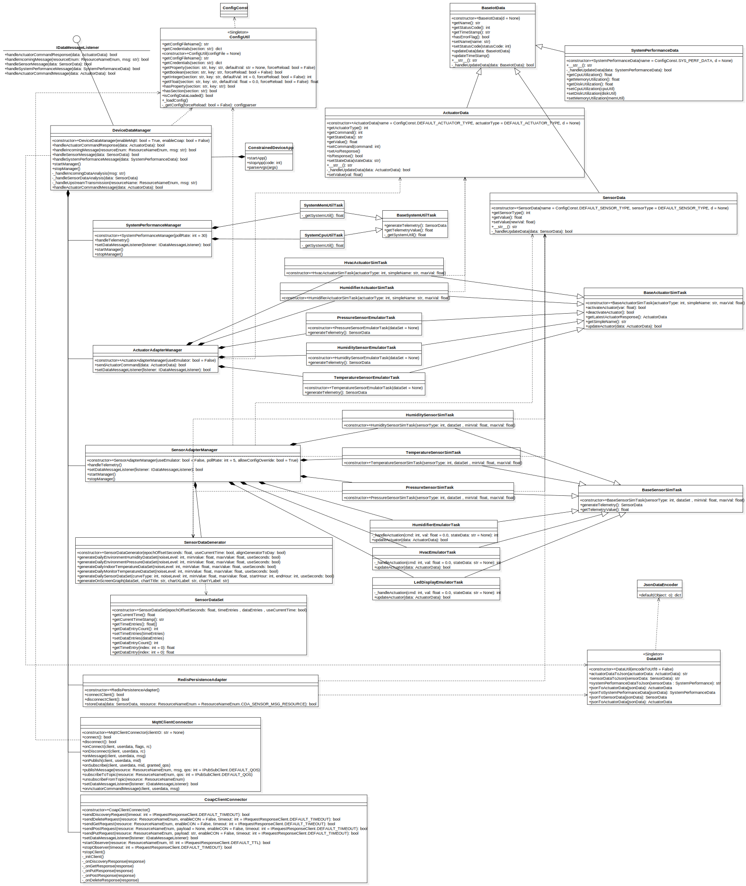

# Constrained Device Application (Connected Devices)

## Lab Module 10

### Description

What does your implementation do? 

1. Update `IDataMessageListener` and `DeviceDataManager` to handle incoming `ActuatorData` commands
2. Update `MqttClientConnector` to subscribe to `ActuatorData` command messages from the GDA
3. Update `DeviceDataManager` to send sensor, system performance, actuator response messages to the GDA
4. Update sensor and actuator data containers and related tasks to set appropriate device name
5. Run some integration test to test trigger of floor and ceiling
6. Run some performance test on MQTT and CoAP clients

How does your implementation work?

1. Implement `handleActuatorCommandMessage()` method in `DeviceDataManager` and `IDataMessageListener`
2. Update `onActuatorCommandMessage` method in `MqttClientConnector`
3. Update `_handleUpstreamTransmission`, `handleIncomingMessage`, `_handleIncomingDataAnalysis` methods in `DeviceDataManager`
4. Add a variable which got from `ConfigConst` to setup each sensor and actuator data container's name
5. Add `DeviceDataManagerIntegrationTest` to test trigger of floor and ceiling of temperature
6. Add `CoapClientPerformanceTest` adn `MqttClientPerformanceTest` to test performance of MQTT and CoAP clients

### Code Repository and Branch

URL: https://github.com/NU-CSYE6530-Fall2020/constrained-device-app-Taowyoo/tree/alpha001

### UML Design Diagram(s)

Here is latest class diagram of current code:


### Unit Tests Executed

- HumidifierActuatorSimTaskTest
- HumiditySensorSimTaskTest
- HvacActuatorSimTaskTest
- PressureSensorSimTaskTest
- TemperatureSensorSimTaskTest
- ActuatorDataTest
- SensorDataTest
- SystemPerformanceDataTest

### Integration Tests Executed

- DeviceDataManagerCallbackTest
- MqttClientConnectorTest
- DeviceDataManagerIntegrationTest
- LedDisplayEmulatorTaskTest
- HvacEmulatorTaskTest
- HumidifierEmulatorTaskTest
- DataIntegrationTest
- CoapClientPerformanceTest
- MqttClientPerformanceTest

### CDA MQTT Client Performance Test Results

#### Summary

1. Speed
   1. QoS 0 > QoS 1 > QoS 2
   2. QoS 1 is slower than QoS 0 by 95.20%
   3. QoS 2 is slower than QoS 0 by 202.36%

2. The connect / disconnect cost about 2.198392 ms

#### Log 

##### Connect and Disconnect

```log
2020-12-03 23:27:55,531:MqttClientConnector:INFO:MQTT client is disconnecting from broker...
2020-12-03 23:27:55,531:MqttClientConnector:INFO:[Callback] Connected to MQTT broker. Result code: 0
2020-12-03 23:27:55,531:MqttClientConnector:INFO:[Callback] MQTT client succeed to disconnect from broker.
2020-12-03 23:27:55,531:MqttClientPerformanceTest:INFO:Connect and Disconnect: 2.198392 ms
```

##### QoS 0

```log
2020-12-03 23:27:55,532:MqttClientConnector:INFO:	MQTT Broker Host: localhost
2020-12-03 23:27:55,532:MqttClientConnector:INFO:	MQTT Broker Port: 1883
2020-12-03 23:27:55,532:MqttClientConnector:INFO:	MQTT Keep Alive:  60
2020-12-03 23:27:55,532:MqttClientConnector:INFO:Creating MQTT client...
2020-12-03 23:27:55,532:MqttClientConnector:INFO:Succeed to create MQTT client!
2020-12-03 23:27:55,532:MqttClientConnector:INFO:Connecting MQTT client to broker at localhost:1883...
2020-12-03 23:27:55,532:MqttClientConnector:INFO:[Callback] Connected to MQTT broker. Result code: 0
2020-12-03 23:27:56,112:MqttClientConnector:INFO:MQTT client is disconnecting from broker...
2020-12-03 23:27:57,113:MqttClientConnector:INFO:[Callback] MQTT client succeed to disconnect from broker.
2020-12-03 23:27:57,114:MqttClientPerformanceTest:INFO:Publish message - QoS 0 [10000]: 579.840037 ms
```

##### QoS 1

```log
2020-12-03 23:27:57,114:MqttClientConnector:INFO:	MQTT Broker Host: localhost
2020-12-03 23:27:57,114:MqttClientConnector:INFO:	MQTT Broker Port: 1883
2020-12-03 23:27:57,114:MqttClientConnector:INFO:	MQTT Keep Alive:  60
2020-12-03 23:27:57,114:MqttClientConnector:INFO:Creating MQTT client...
2020-12-03 23:27:57,114:MqttClientConnector:INFO:Succeed to create MQTT client!
2020-12-03 23:27:57,114:MqttClientConnector:INFO:Connecting MQTT client to broker at localhost:1883...
2020-12-03 23:27:57,115:MqttClientConnector:INFO:[Callback] Connected to MQTT broker. Result code: 0
2020-12-03 23:27:58,246:MqttClientConnector:INFO:MQTT client is disconnecting from broker...
2020-12-03 23:27:59,248:MqttClientConnector:INFO:[Callback] MQTT client succeed to disconnect from broker.
2020-12-03 23:27:59,248:MqttClientPerformanceTest:INFO:Publish message - QoS 1 [10000]: 1131.872723 ms
```

##### QoS 2

```log
2020-12-03 23:27:59,248:MqttClientConnector:INFO:	MQTT Broker Host: localhost
2020-12-03 23:27:59,248:MqttClientConnector:INFO:	MQTT Broker Port: 1883
2020-12-03 23:27:59,248:MqttClientConnector:INFO:	MQTT Keep Alive:  60
2020-12-03 23:27:59,248:MqttClientConnector:INFO:Creating MQTT client...
2020-12-03 23:27:59,248:MqttClientConnector:INFO:Succeed to create MQTT client!
2020-12-03 23:27:59,248:MqttClientConnector:INFO:Connecting MQTT client to broker at localhost:1883...
2020-12-03 23:27:59,249:MqttClientConnector:INFO:[Callback] Connected to MQTT broker. Result code: 0
2020-12-03 23:28:01,002:MqttClientConnector:INFO:MQTT client is disconnecting from broker...
2020-12-03 23:28:02,003:MqttClientConnector:INFO:[Callback] MQTT client succeed to disconnect from broker.
2020-12-03 23:28:02,003:MqttClientPerformanceTest:INFO:Publish message - QoS 2 [10000]: 1753.247647 ms
```

### CDA CoAP Client Performance Test Results

#### Summary

1. Speed
   1. NON is slower then CON
   2. There might be some problem about python CoAP client?
   3. CON is faster then NON by about 173.06%(109.38% libcoap2)

#### Log 

#### Using Eclipse Californium

```log
Testing POST - CON
POST message - useCON = True [10000]: 7124.71237 ms
Testing POST - NON
POST message - useCON = False [10000]: 19454.900152 ms
```

#### Using libcoap2

```log
Testing POST - CON
POST message - useCON = True [10000]: 4635.929939 ms
Testing POST - NON
POST message - useCON = False [10000]: 9707.018681 ms
```