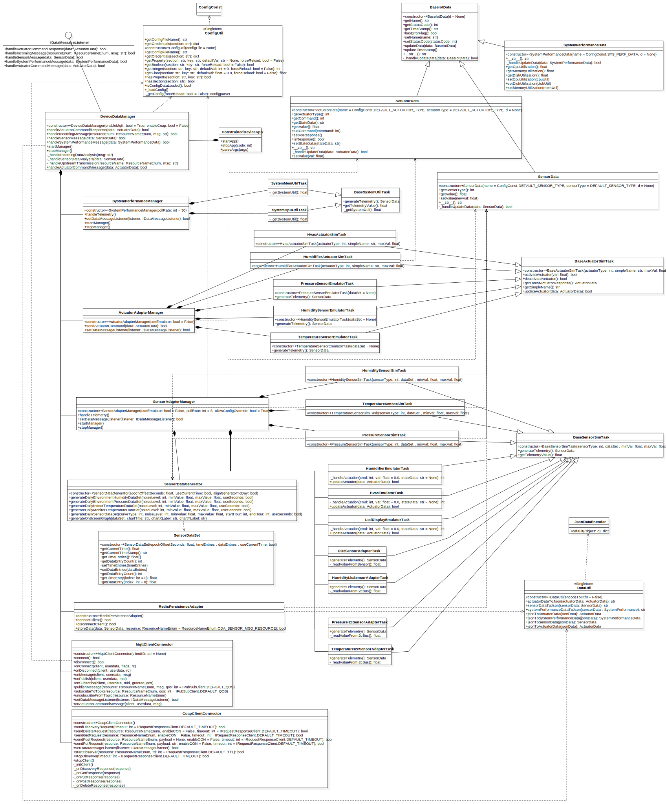

# Constrained Device Application (Connected Devices)

## Lab Module 12 - Semester Project - CDA Components

### Description

**What does your implementation do?**

1. Update config of MQTT client to connect to server in home LAN
2. Add `CO2SensorAdapterTask` implementation
3. Add config to control the run time of CDA in `ConstrainedDeviceApp`
4. Add auto logging and logging config file
5. Update `SensorAdapterManagerTest` to test SenseHAT and CO2 sensor better
6. Update `CoapClientConnectorTest` to test CoAP server better
7. Add feature of control whether use I2C or `pisense` to communicate withg SenseHAT
8. Add `SystemDiskUtilTask` 

**How does your implementation work?**

1. Update the host address for MQTT client in `PiotConfig.props`
2. Use `adafruit_ccs811` library to use CCS811 CO2 gas sensor, just read eCO2 value. Also, check whether data is abnormal and set the `statusCode`
3. Use python's logging module and logging config file to automatically logging to console and file. By use `TimedRotatingFileHandler`, program can logging file with timestamp and auto spilt log file by time
4. Use `shutil` to get current disk usage value on root dir `/`
5. Add some if-else and config to enable the feature of choosing whether use I2C or `pisense` to read humidity/temperature/pressure data from SenseHAT
5. Update `CoapClientConnectorTest` to PUT/POST first then GET/DELETE, avoiding there is no data on CoAP Server.
6. Update `SensorAdapterManagerTest` to test using `pisense`

### Code Repository and Branch

URL: https://github.com/NU-CSYE6530-Fall2020/constrained-device-app-Taowyoo/tree/alpha001

### UML Design Diagram(s)

Latest class diagram of CDA util semester project:

### Unit Tests Executed

- All tests in part01 and part02 

### Integration Tests Executed

- SensorAdapterManagerTest
- CoapClientConnectorTest
- ConstrainedDeviceAppTest